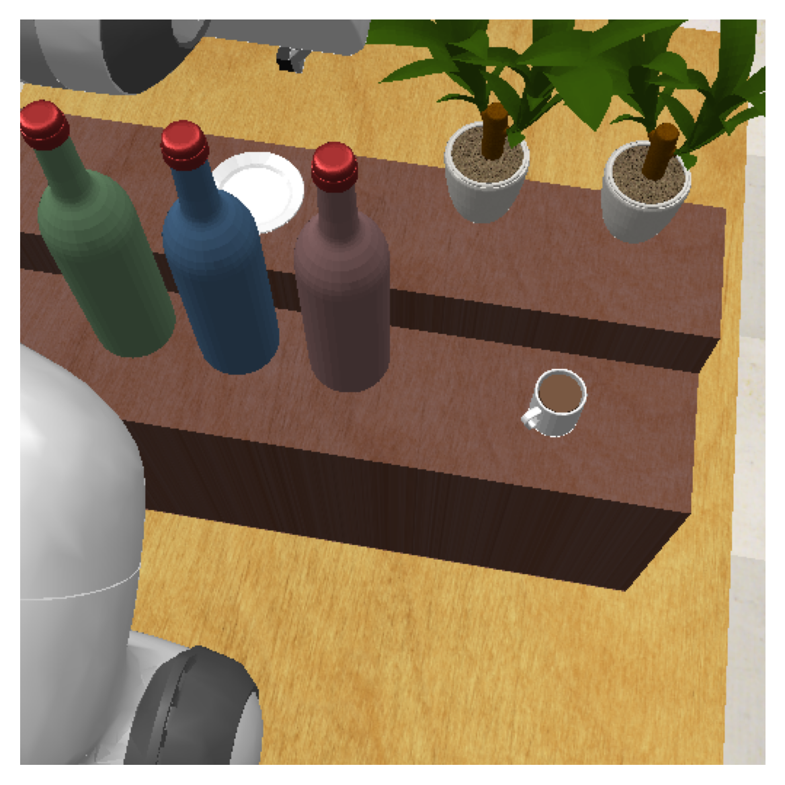

# Code for Redundancy-aware Action Spaces for Robot Learning

    
    
    

    
    
    

## RL experiments

### How to run

For running the code, using Docker is recommended.

To start the container, run:

`bash docker_run.sh`

To start an experiment launch a command inside the docker like:

`sh xvfb_run.sh python3 rl/train.py use_wandb=False project_name=er agent=sac configs=rlbench_both task=rlbench_stack_wine env.action_mode=erjoint seed=1,2,3 experiment=test --multirun &`

The command above launches 3 seeds in parallel. You should set `seed=SEED` to a unique value and remove `--multirun` to run a single experiment.

Note that by default all log is redirected to the experiments folder in `out.log` and `err.log`, so no output will be logged in your console.

### Options

The possible action modes are: `env.action_mode=joint,ee,erjoint,erangle`

You can change the ERJ joint to the wrist one by setting: `+env.erj_joint=6`

### Notes

* The implementation of SAC (with distributional critic) can be found at `rl/agent/sac.py` along with the hyperparameters used in the `sac.yaml` file.
* The new RLBench tasks can be found at `rl/env/custom_rlbench_tasks.py`
* The new action modes can be found at `rl/env/custom_arm_action_modes.py`

## Imitation learning experiments

For the real-world experiments we used ACT: https://github.com/tonyzhaozh/act

Some additional notes about the setup are:
* Each action space model was trained for 3000 epochs using the hyper-parameters presented in the ACT paper (apart from using a batch size of 16, and chunk size of 20). 
* Additionally, the EE pose was added to the state information. 
* All quaternions in demonstrations and inference were forced to have a positive `w`. Lastly, only a wrist camera (with resolution 224x224) was used.

For the IK in we used: [pick\_ik](https://github.com/PickNikRobotics/pick_ik) with default parameters for solving the IK for EE and ERJ. 

Some additional notes:
* We followed the standard [pick\_ik Kinematics Solver" tutorial](https://moveit.picknik.ai/main/doc/how_to_guides/pick_ik/pick_ik_tutorial.html\#pick-ik-kinematics-solver) from the pick\_ik documentation
* We only altered two parameters for the IK, from the standard parameters: `approximate_solution_position_threshold=0.01` and `approximate_solution_orientation_threshold=0.01` (both from the original value 0.05) to increase accuracy

